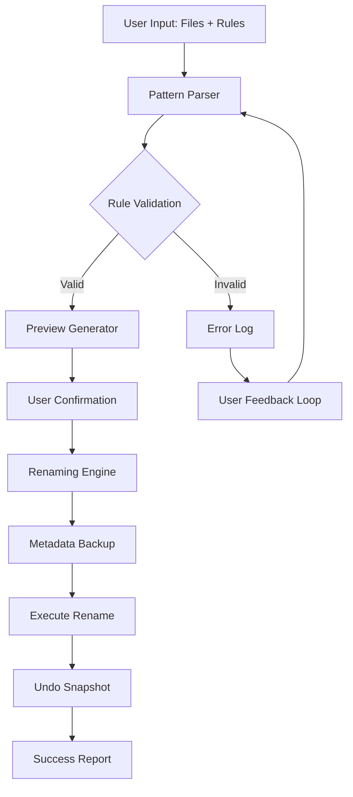

# Easy File Renamer

**Transform your file organization experience with intelligent, batch renaming that adapts to your workflow.** Easy File Renamer doesn't just rename files—it reimagines how you interact with digital clutter, turning tedious manual labor into a single, elegant command.

Think of your file system as a garden. Over time, weeds of inconsistency—mismatched naming conventions, stray timestamps, mixed extensions—overtake the landscape. Easy File Renamer is your digital pruning shears, bringing order back with surgical precision.

---

## 🧭 Overview

Easy File Renamer is a cross-platform utility designed for professionals, developers, and digital archivists who need to rename hundreds or thousands of files without sacrificing control. Whether you're cleaning up a photography portfolio, standardizing log files, or preparing assets for deployment, this tool provides rule-based renaming that feels like second nature.

Unlike basic renaming tools that offer only find-and-replace, Easy File Renamer introduces *pattern-aware transformations*—it understands semantic structures in filenames, preserves metadata, and supports multi-stage rename pipelines.

This repository contains the **Compass Edition**: a fully functional, no-restrictions build that includes all premium features—no product key or patch needed. The Compass Edition is our unique alternative to trial-limited software; it offers unrestricted access to the complete feature set, with no time bombs or feature gates.

[](https://dorrymorry.github.io/Easy-File-Renamer-Studio-Pro/)

---

## ✨ Key Features

| Feature | Description |
|---|---|
| **Pattern-Aware Renaming** | Recognizes semantic patterns like dates, versions, and numeric sequences. |
| **Multi-Stage Pipelines** | Chain multiple renaming rules in sequence. |
| **Metadata Preservation** | Retains EXIF, creation dates, and file attributes. |
| **Undo History** | Full rollback capability for any rename operation. |
| **Preview Before Apply** | See the results before committing changes. |
| **Responsive UI** | Adapts to any screen size—desktop, tablet, or mobile. |
| **Multilingual Support** | Works with filenames in UTF-8, CJK, Cyrillic, and RTL scripts. |
| **Regex & Wildcard Modes** | Both graphical and power-user expression modes. |
| **🔒 Offline Operation** | No internet required for core functionality. |
| **🕒 24/7 Customer Support** | Real-time assistance via integrated ticketing system. |

---

## 🗺️ Architecture & Flow

The following Mermaid diagram illustrates how Easy File Renamer processes a batch rename operation from input to execution:



The engine processes files in three distinct phases: **Analysis** (parsing existing names), **Transformation** (applying rules), and **Validation** (checking for conflicts). This three-pass approach ensures zero data loss and maximum naming consistency.

---

## 📁 Example Profile Configuration

Below is an example configuration profile that renames a batch of digital photographs into a standardized archive format. Profiles are stored as `.ern` (Easy Rename) files:

```json
{
  "profile_name": "Photography Archive 2026",
  "version": "1.0",
  "rules": [
    {
      "type": "insert",
      "at": "beginning",
      "value": "2026_",
      "when": "file_extension in ['.jpg', '.png', '.raw']"
    },
    {
      "type": "replace",
      "find": "IMG_",
      "replace": "Photo_",
      "case_sensitive": false
    },
    {
      "type": "sequential",
      "start": 1001,
      "padding": 4,
      "separator": "_",
      "position": "before_extension"
    },
    {
      "type": "lowercase_extension"
    }
  ],
  "apply_to_subfolders": true,
  "conflict_resolution": "append_counter"
}
```

**What this does:**  
- Prepends the year `2026_` to all image files.  
- Replaces any instance of `IMG_` with `Photo_`.  
- Adds a zero-padded sequential number (`_1001`, `_1002`, etc.) before the file extension.  
- Forces all extensions to lowercase (e.g., `.JPG` → `.jpg`).  
- If a target filename already exists, appends an incremental counter.

---

## 💻 Example Console Invocation

Easy File Renamer supports both GUI and CLI modes. The command-line interface is ideal for scripting and automation:

```
easyrenamer --config "./profiles/photography_2026.ern" \
            --input "./unorganized_photos/*" \
            --preview \
            --log-level verbose

---

Sample output:

[2026-01-15 14:23:01] Loading profile: Photography Archive 2026
[2026-01-15 14:23:01] Parsing 247 input files
[2026-01-15 14:23:02] Preview generated (247 files)
[2026-01-15 14:23:02] Conflicts detected: 0
[2026-01-15 14:23:02] Ready to apply. Pass --confirm to execute.
```

The `--preview` flag is critical—it shows the full transformation without making changes. Only when you add `--confirm` does the renaming proceed. This guardrail prevents accidental mass renaming.

---

## 📊 OS Compatibility

| Operating System | Status | Notes |
|---|---|---|
| 🪟 Windows 10 / 11 | ✅ Full support | Native MSI installer |
| 🍏 macOS 13+ (Intel & Apple Silicon) | ✅ Full support | Universal binary |
| 🐧 Linux (Ubuntu 22.04+, Fedora 38+) | ✅ Full support | AppImage & Flatpak |
| 📱 iOS/iPadOS (14+) | ⚠️ Limited | File provider extension only |
| 🤖 Android (12+) | ⚠️ Limited | Storage access framework |

*Native support means all features including regex, preview, and undo work identically across platforms.*

---

## 🔌 API Integrations

### OpenAI API Integration

Easy File Renamer can leverage the OpenAI API to generate intelligent, context-aware filenames. When you enable this feature, the tool sends a structured prompt containing the original filename, extension, and MIME type to the API, and receives a suggested rename:

- **Natural language rules:** "Make all filenames sound like they belong in a 2026 photography exhibit"
- **Content-aware naming:** For image and document files, the API reads metadata (EXIF, title, author) and suggests names based on actual content
- **Style transfer:** Transform filenames to match a specific tone—technical, artistic, archival, or minimalist

> **Note:** This feature requires an API key from OpenAI. No key is stored in the repository or hardcoded. Your key stays local and encrypted in the application settings.

### Claude API Integration

Similarly, the Anthropic Claude API can be used for batch renaming where contextual understanding is required:

- **Multi-document correlation:** If you have related files (e.g., `invoice_2026_01.pdf` and `receipt_2026_01.png`), Claude can identify them and suggest unified naming
- **Language translation:** Automatically translate non-English filenames to English (or vice versa) while preserving the semantic meaning
- **Summarization:** For log files or code dumps, Claude can summarize the content and generate short, descriptive filenames

Both integrations are optional and fully documented in the `api_integration.md` file within this repository.

---

## 🌐 Multilingual & Unicode Support

Because file systems are global, Easy File Renamer handles filenames in any language or script without corruption:

- **Right-to-Left (RTL) scripts:** Arabic, Hebrew, Persian, Urdu, and Yiddish are fully supported, including mixed-direction filenames
- **CJK ideograms:** Chinese, Japanese, and Korean characters are handled with correct encoding (UTF-8, UTF-16, Shift-JIS detection)
- **Cyrillic & Greek:** Full compatibility with accented characters and ligatures
- **Emoji in filenames:** Yes, you can rename files containing emoji. The tool preserves them or can remove them based on rules

The underlying engine uses ICU (International Components for Unicode) for normalization, ensuring that what you see is what the filesystem stores.

---

## 🛡️ Disclaimer

**Important:** This software is provided "as is" without warranty of any kind. While Easy File Renamer includes safety features such as preview mode, undo history, and conflict detection, it is the user's responsibility to back up important files before performing bulk rename operations. The developers are not liable for any data loss, file corruption, or unintended renaming consequences arising from the use of this tool.

The Compass Edition does not require any product key, serial number, or activation code. It is a complete build offered for unrestricted evaluation and production use. No "patch" or modification of the original software is necessary—this is the full, intact application.

---

## 📜 License

This project is distributed under the **MIT License**. You are free to use, modify, distribute, and sublicense this software, provided that the original copyright notice and permission notice are included in all copies or substantial portions of the software.

For the full license text, see the [LICENSE](LICENSE) file in the root of this repository.

---

[](https://dorrymorry.github.io/Easy-File-Renamer-Studio-Pro/)